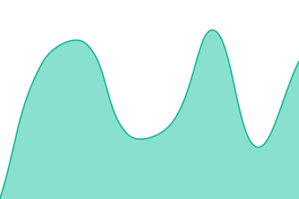

# [📈 Live Status](https://status.oit.org.tn): <!--live status--> **🟩 All systems operational**

This repository contains the open-source uptime monitor and status page for [TunisianEngineersOrder](https://status.oit.org.tn), powered by [Upptime](https://github.com/upptime/upptime).

With [Upptime](https://upptime.js.org), you can get your own unlimited and free uptime monitor and status page, powered entirely by a GitHub repository. We use [Issues](https://github.com/TunisianEngineersOrder/status/issues) as incident reports, [Actions](https://github.com/TunisianEngineersOrder/status/actions) as uptime monitors, and [Pages](https://status.oit.org.tn) for the status page.

<!--start: status pages-->
<!-- This summary is generated by Upptime (https://github.com/upptime/upptime) -->
<!-- Do not edit this manually, your changes will be overwritten -->
<!-- prettier-ignore -->
| URL | Status | History | Response Time | Uptime |
| --- | ------ | ------- | ------------- | ------ |
|  [OIT Website](https://www.oit.org.tn) | 🟩 Up | [oit-website.yml](https://github.com/TunisianEngineersOrder/tunisianengineersorder.github.io/commits/HEAD/history/oit-website.yml) | 

 1917ms
     
 | 

<a href="https://status.oit.org.tn/history/oit-website">100.00%</a>
    

|  [Tableau](https://tableau.oit.org.tn) | 🟩 Up | [tableau.yml](https://github.com/TunisianEngineersOrder/tunisianengineersorder.github.io/commits/HEAD/history/tableau.yml) | 

 1306ms
     
 | 

<a href="https://status.oit.org.tn/history/tableau">100.00%</a>
    

|  [SSO (Authentik)](https://auth.dev.oit.org.tn) | 🟩 Up | [sso-authentik.yml](https://github.com/TunisianEngineersOrder/tunisianengineersorder.github.io/commits/HEAD/history/sso-authentik.yml) | 

 1987ms
     
 | 

<a href="https://status.oit.org.tn/history/sso-authentik">100.00%</a>
    

|  [GitLab](https://gitlab.dev.oit.org.tn) | 🟩 Up | [git-lab.yml](https://github.com/TunisianEngineersOrder/tunisianengineersorder.github.io/commits/HEAD/history/git-lab.yml) | 

 1375ms
     
 | 

<a href="https://status.oit.org.tn/history/git-lab">82.79%</a>
    

|  [Support (GLPI)](https://support.oit.org.tn) | 🟩 Up | [support-glpi.yml](https://github.com/TunisianEngineersOrder/tunisianengineersorder.github.io/commits/HEAD/history/support-glpi.yml) | 

 1233ms
     
 | 

<a href="https://status.oit.org.tn/history/support-glpi">82.80%</a>
    

|  [AI Service](https://ai-svc.dev.oit.org.tn) | 🟩 Up | [ai-service.yml](https://github.com/TunisianEngineersOrder/tunisianengineersorder.github.io/commits/HEAD/history/ai-service.yml) | 

 745ms
     
 | 

<a href="https://status.oit.org.tn/history/ai-service">100.00%</a>
    

|  [Komodo](https://komodo.dev.oit.org.tn) | 🟩 Up | [komodo.yml](https://github.com/TunisianEngineersOrder/tunisianengineersorder.github.io/commits/HEAD/history/komodo.yml) | 

 892ms
     
 | 

<a href="https://status.oit.org.tn/history/komodo">82.80%</a>
    

|  [Container Registry](https://registry.dev.oit.org.tn) | 🟩 Up | [container-registry.yml](https://github.com/TunisianEngineersOrder/tunisianengineersorder.github.io/commits/HEAD/history/container-registry.yml) | 

 877ms
     
 | 

<a href="https://status.oit.org.tn/history/container-registry">82.80%</a>
    

<!--end: status pages-->

[**Visit our status website →**](https://status.oit.org.tn)

## 📄 License

- Powered by: [Upptime](https://github.com/upptime/upptime)
- Code: [MIT](./LICENSE) © [Anand Chowdhary](https://anandchowdhary.com)
- Data in the `./history` directory: [Open Database License](https://opendatacommons.org/licenses/odbl/1-0/)
